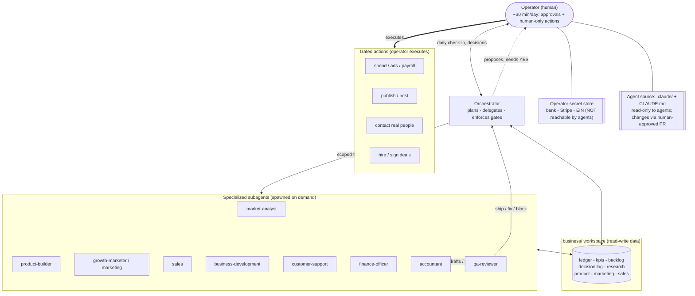

# Runbook: topology & how to run it

## Topology — how the orchestrator interacts with the agents



**Reading the diagram:**
- The **operator** talks only to the **orchestrator** (the daily check-in) and
  is the only actor who executes gated actions and holds secrets.
- The **orchestrator** never does the specialist work itself — it breaks the
  plan into scoped tasks and delegates to the **subagents**, which start cold
  and get self-contained context.
- Subagent output passes through **qa-reviewer** before it reaches the operator.
- All agents read/write the **`business/` workspace**; none can reach the
  **source** or the **secret store**.
- Anything that spends, publishes, contacts a person, or signs a deal is a
  **gated action**: the orchestrator prepares it, the operator says yes and
  executes it.

## Where the code lives

- **Remote (source of truth):** the GitHub repo `lillytp/Hosted-Payloads`.
  Development branch: `claude/business-agent-orchestrator-sb53w6` (merge to
  `main` when you're happy with it).
- **The system's parts:**
  - `.claude/agents/*.md` — the agent definitions (the "roster").
  - `.claude/settings.json` — permission guardrails (source is read-only to agents).
  - `CLAUDE.md` — tells any Claude Code session to act as the orchestrator.
  - `business/**` — the operating docs and the live workspace/data.

## How to start the orchestrator on your laptop

1. **Install Claude Code** (once):
   ```bash
   npm install -g @anthropic-ai/claude-code
   ```
2. **Clone the repo and check out the branch:**
   ```bash
   git clone https://github.com/lillytp/Hosted-Payloads.git
   cd Hosted-Payloads
   git checkout claude/business-agent-orchestrator-sb53w6
   ```
3. **Put your secrets in your own store** (password manager / OS keychain), and
   optionally copy `business/state/company.example.json` to `company.json` and
   fill in only the non-sensitive public fields. Never paste secrets into chat.
4. **Start Claude Code in the repo:**
   ```bash
   claude
   ```
   It auto-loads `CLAUDE.md`, so the session acts as the orchestrator, and it
   discovers the subagents in `.claude/agents/`.
5. **Run the daily loop** — just say:
   > run the daily check-in
   The orchestrator reads state, briefs you, asks for decisions, and delegates.
   To begin the very first time, say:
   > kick off the opportunity-selection cycle

## Applying an approved code change

The permission rules stop agents from editing their own source, so **you** apply
code changes: edit the file in your editor (or merge a PR), commit, and note it
in `DECISION_LOG.md`. That's the human-approval gate for code, enforced
structurally rather than by trust.
